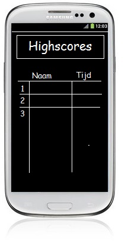

Crazy Cuboid Concept
==========


Activities:
-------------
* SplashActivity
	* splashscreen
	* gaat over in StartMenuActivity
	
* StartMenuActivity 	
	* Activity heeft een image als achtergrond
	* In het startmenu is een bewegende (ronddraaiende) rechthoek te zien (animatie).
	* Het startmenu heeft drie buttons
	* De startbutton gaat naar GameActivity
	* De highscorebutton gaat naar HighscoreActivity
	* De exitbutton sluit de applicatie af
	* 
	
* GameActivity
	* Deze activity heeft een grote map als background
	* Midden in het scherm is een ronddraaiende rechthoek te zien
	* Ontouch verplaats deze rechthoek zich richting het aangeraakte punt
	* Bij dit verplaatsen blijft de rechthoek in het midden maar wordt er door de map gescrold.
	* Als de rechthoek/balk een object of muur raakt heeft de speler verloren en gaat de speler naar EndofgameActivity
	* Als de rechthoek/balk het eindobject raakt gaat heeft de speler gewonnen en gaat de speler naar EndofgameActivity
	* 
	
* HighscoreActivity
	* 
	
* EndofgameActivity 
	* Popup met tekst
	* Kan highscore invullen
	* knop met restart gaat naar GameActivity
	* knop met exit gaat naar StartMenuActivity
	* 

* Activity Sketch:
	* 

Databases:
-------------
*	Highscores worden opgeslagen in een SQLite database


Styleguide:
==========

Voor de programmeerstijl gebruik ik de Google Java Programming Guide, ook te vinden op https://google-styleguide.googlecode.com/svn/trunk/javaguide.html, met de volgende uitzonderingen:

Comments
-------------
Comments van één regel worden als volgt gedaan:
```
//dit is een comment
```
Comments van meerdere regels worden anders gedaan:
```
/*
 * Dit is een comment.
 * Met meerdere regels.
 */
```
Braces
-------------
Braces worden geopend op een new line en gesloten op een new line.
```
int voorbeeld(int a)
{
    return a;
}
```
