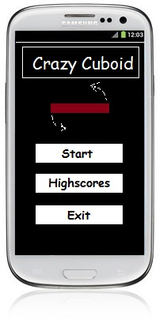
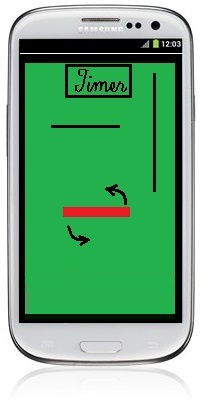
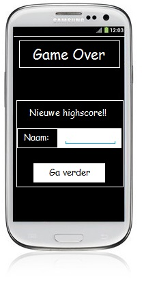
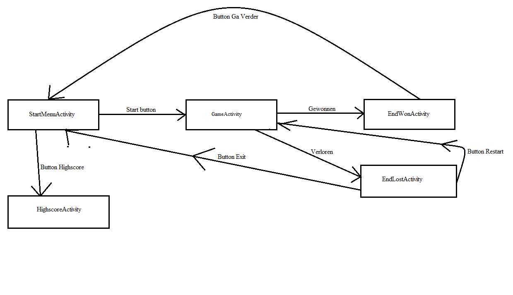

Crazy Cuboid Concept
==========


Activities:
-------------
* SplashActivity
	* splashscreen
	* gaat over in StartMenuActivity
	
* StartMenuActivity 	
	* 
	
* GameActivity
	* 
	
* HighscoreActivity
	* 
	
* EndofgameActivity 
	* Popup met tekst
	* Kan highscore invullen
	* knop met restart gaat naar GameActivity
	* knop met exit gaat naar StartMenuActivity
	* 

* Activity Sketch:
	* 

Databases:
-------------
*	Highscores worden opgeslagen in een SQLite database


Styleguide:
==========

Voor de programmeerstijl gebruik ik de Google Java Programming Guide, ook te vinden op https://google-styleguide.googlecode.com/svn/trunk/javaguide.html, met de volgende uitzonderingen:

Comments
-------------
Comments van één regel worden als volgt gedaan:
```
//dit is een comment
```
Comments van meerdere regels worden anders gedaan:
```
/*
 * Dit is een comment.
 * Met meerdere regels.
 */
```
Braces
-------------
Braces worden geopend op een new line en gesloten op een new line.
```
int voorbeeld(int a)
{
    return a;
}
```
